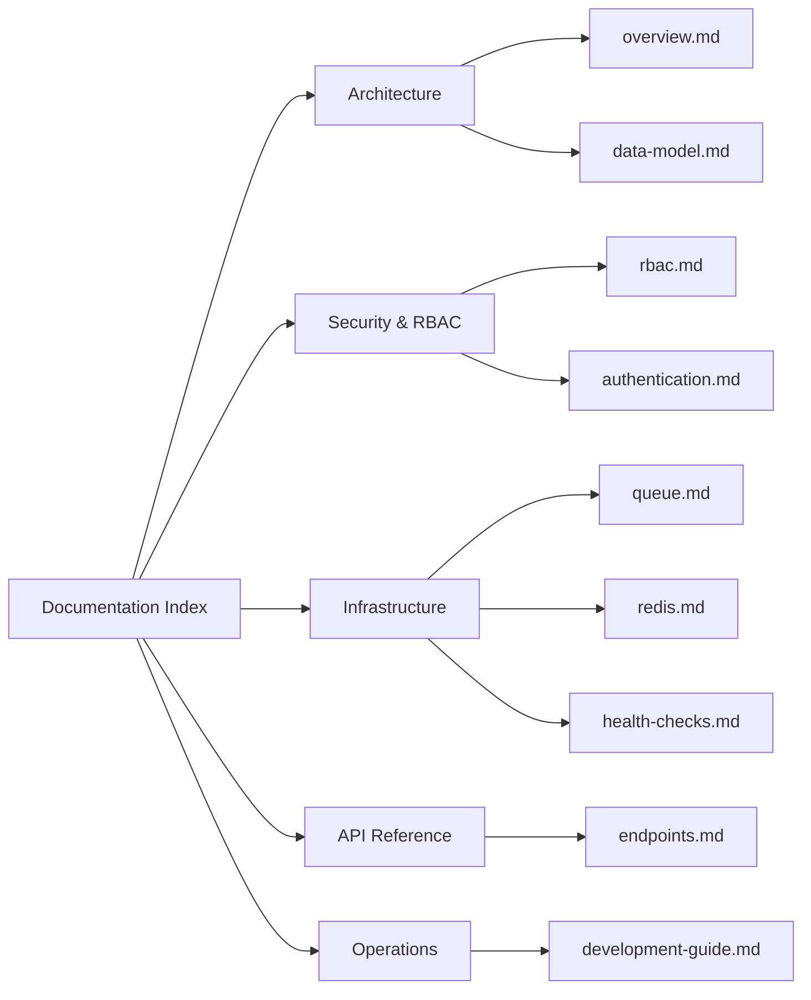

# System Documentation

Welcome to the technical documentation for the **Backend API**. This documentation is organized into focused guides covering architecture, security, infrastructure, API endpoints, and operational workflows.

---

## Documentation Navigation

---

## Directory Structure

### 1. [Architecture](./architecture/)
* **[System Overview](./architecture/overview.md)**: Architectural patterns, clean separation of concerns, layered design, and global middleware pipeline.
* **[Data Model & Schema](./architecture/data-model.md)**: Prisma database models, Entity-Relationship Diagram (ERD), relationships, and migration workflows.

### 2. [Security & RBAC](./security/)
* **[Role-Based Access Control (RBAC)](./security/rbac.md)**: Detailed breakdown of Task 19 & 20, `authenticate()` and `authorize("ADMIN")` middlewares, and the distinction between 401 Unauthorized and 403 Forbidden.
* **[Authentication & Token Lifecycle](./security/authentication.md)**: JWT access tokens, refresh token rotation, Argon2 password hashing, and cookie management.

### 3. [Infrastructure](./infrastructure/)
* **[Queue Abstraction & Events](./infrastructure/queue.md)**: `QueueService` interface (Task 22), `LocalQueueService` adapter, post-commit `USER_REGISTERED` event emission (Task 23), and future SQS migration.
* **[Redis Connection](./infrastructure/redis.md)**: Infrastructure integration (Task 21), connection management, and `SET/GET health:redis` verification.
* **[Health Checks & Probes](./infrastructure/health-checks.md)**: Kubernetes-compliant Liveness (`/health/live`) and Readiness (`/health/ready`) probes (Task 24).

### 4. [API Reference](./api/)
* **[Endpoints & OpenAPI Specification](./api/endpoints.md)**: Complete catalog of endpoints, payload schemas, error formats, and interactive Swagger documentation (`/docs`).

### 5. [Operations & Development](./operations/)
* **[Development Guide](./operations/development-guide.md)**: Local setup, Docker Compose commands, Prisma migrations, admin seeding, and automated test execution.
