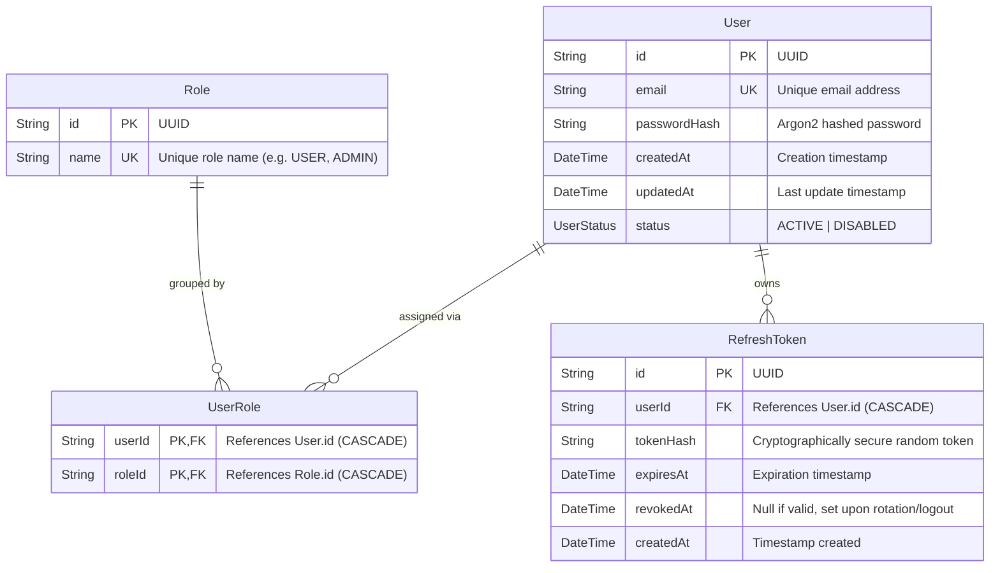

# Data Model & Schema

This document outlines the database schema, entity relationships, and migration procedures managed by **Prisma 7** with PostgreSQL.

---

## 1. Entity-Relationship Diagram (ERD)



---

## 2. Models & Data Structure Details

### User (`prisma.user`)
Stores user accounts.
* `id` (`String`): UUID primary key.
* `email` (`String`): Unique user identifier.
* `passwordHash` (`String?`): Argon2id password hash.
* `status` (`UserStatus`): Enumeration with values `ACTIVE` or `DISABLED`.
* `roles` (`UserRole[]`): Many-to-many relationship with `Role` through `UserRole`.
* `refreshTokens` (`RefreshToken[]`): User's issued refresh tokens.

### Role (`prisma.role`)
Stores assignable system roles.
* `id` (`String`): UUID primary key.
* `name` (`String`): Unique identifier (e.g. `USER`, `ADMIN`).

### UserRole (`prisma.userRole`)
Composite junction table implementing the many-to-many relationship between `User` and `Role`.
* `userId` + `roleId`: Composite primary key (`@@id([userId, roleId])`).
* `onDelete: Cascade`: When a user or role is deleted, corresponding associations are removed.

### RefreshToken (`prisma.refreshToken`)
Enforces secure token rotation and multi-device session management.
* `tokenHash` (`String`): 80-character hex string generated via `crypto.randomBytes(40)`.
* `expiresAt` (`DateTime`): Token validity limit (e.g. 7 days).
* `revokedAt` (`DateTime?`): Used for revocation upon logout or token rotation. Tokens with a non-null `revokedAt` or expired `expiresAt` are rejected.

---

## 3. Prisma 7 Driver Adapter Configuration

Prisma 7 uses driver adapters to connect to PostgreSQL over TCP sockets instead of an external Rust binary engine:

* **Configuration File (`prisma.config.ts`)**:
  ```ts
  import "dotenv/config";
  import { defineConfig, env } from "prisma/config";

  export default defineConfig({
    schema: "prisma/schema.prisma",
    datasource: {
      url: env("DATABASE_URL"),
    },
  });
  ```

* **Client Instantiation (`src/config/prisma.ts`)**:
  ```ts
  import { PrismaClient } from "@prisma/client";
  import { PrismaPg } from "@prisma/adapter-pg";

  const adapter = new PrismaPg(process.env.DATABASE_URL!);
  export const prisma = new PrismaClient({ adapter });
  ```

---

## 4. Migration & Schema Workflow

```bash
# Apply schema changes and create a migration file
npx prisma migrate dev --name <migration_name>

# Regenerate Prisma Client types
npx prisma generate

# Validate schema without running migrations
npx prisma validate

# Format schema syntax
npx prisma format
```
