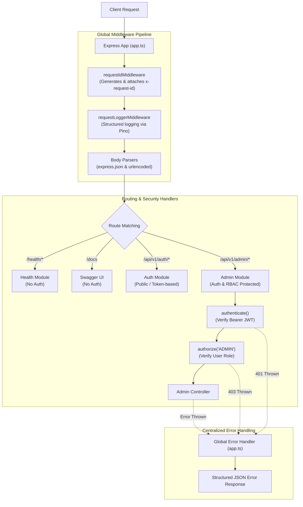

# Architecture Overview

This document describes the high-level architecture, design principles, and component interactions of the application.

---

## 1. Architectural Principles

The application is structured following **Clean Architecture** and **Layered Architecture** principles:

1. **Separation of Concerns**:
   * **Presentation Layer** (`routes`, `middlewares`): HTTP routing, request parsing, authentication verification, and RBAC authorization.
   * **Application / Controller Layer** (`controller`): HTTP parameter extraction, delegating business logic to services, and response formatting.
   * **Domain / Business Layer** (`service`): Business rules, validation, transaction orchestration, domain event publishing.
   * **Data Access Layer** (`repository`): Database queries, transactions, and persistence using Prisma Client.
   * **Infrastructure Layer** (`config`, `common`): Database adapters, Redis client, logger, and message queues.

2. **Dependency Inversion**:
   * High-level modules do not depend on low-level implementation details.
   * Infrastructure dependencies like `QueueService` are abstracted behind TypeScript interfaces to allow swapping local adapters with cloud services (e.g. AWS SQS) without modifying business logic.

---

## 2. Request Lifecycle Pipeline



---

## 3. Technology Stack & Rationale

| Component | Technology | Rationale |
| :--- | :--- | :--- |
| **Runtime & Language** | Node.js (v20+) & TypeScript | Static type safety, modern ECMAScript module support, and native test runner. |
| **HTTP Framework** | Express 5 | Improved async error handling, modern routing capabilities, and widespread ecosystem compatibility. |
| **ORM / Database Driver** | Prisma 7 (`@prisma/adapter-pg`) | Type-safe schema definition, automated SQL migrations, and driver adapter architecture. |
| **Database** | PostgreSQL 16 | ACID-compliant relational storage, foreign key constraints, and transactional consistency. |
| **In-Memory Cache** | Redis 7 (`redis` v6+) | Low-latency caching, session state management, and infrastructure readiness probes. |
| **Password Hashing** | Argon2 (`argon2`) | Winner of the Password Hashing Competition; resistant to GPU and side-channel cracking. |
| **Token Authentication** | JSON Web Tokens (`jsonwebtoken`) | Stateless authentication with signed role claims and tamper resistance. |
| **Logging** | Pino (`pino`, `pino-pretty`) | Extremely fast, structured JSON logging with request correlation IDs. |
| **API Documentation** | Swagger UI (`swagger-ui-express`) | Standardized OpenAPI 3.0 specification with interactive testing. |

---

## 4. Cross-Cutting Concerns

### Request Correlation ID (`x-request-id`)
Every incoming HTTP request is assigned a unique UUID via [`requestIdMiddleware`](../../src/middlewares/requestId.ts). This ID is:
1. Attached to the request object (`req.requestId`).
2. Appended to the response headers (`x-request-id`).
3. Included in all Pino log entries for tracing distributed requests.

### Centralized Error Handling
Errors inherit from [`AppError`](../../src/errors/AppError.ts) (`statusCode`, `code`, `isOperational`, `details`). Non-operational errors are logged as critical errors while operational errors return consistent JSON responses:

```json
{
  "code": "FORBIDDEN",
  "message": "Access forbidden: insufficient permissions"
}
```
