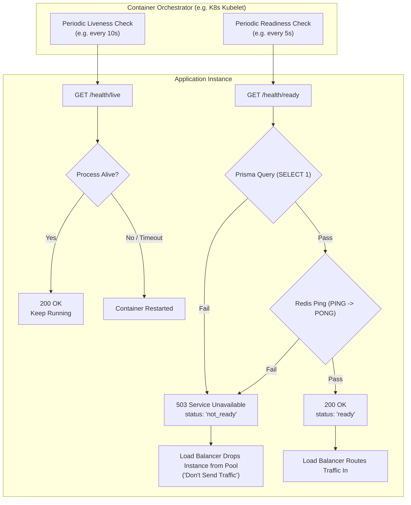

# Health Checks & Monitoring Probes

This document outlines the implementation of **Task 24 (Health Checks: Liveness & Readiness)**.

---

## 1. Overview & Kubernetes Principles

Modern cloud orchestrators (e.g. Kubernetes, AWS ECS, Google Cloud Run) require two distinct health probes to manage container lifecycles:

| Probe | Endpoint | Purpose | Failure Consequence |
| :--- | :--- | :--- | :--- |
| **Liveness** | `GET /health/live` | Verifies the Node.js process is alive, responding, and not in an unrecoverable deadlock. | **Restart**: Orchestrator kills and restarts the container pod. |
| **Readiness** | `GET /health/ready` | Verifies the service has established connections to all critical dependencies (DB, Redis) and can process incoming traffic. | **Don't Send Traffic**: Load balancer temporarily cuts traffic to this container until it recovers. |

---

## 2. Probe Lifecycle Architecture



---

## 3. Endpoints & Response Payloads

### Liveness Probe (`GET /health/live`)
Fast, non-blocking check that does not touch external resources.

* **Response Status**: `200 OK`
* **Response Body**:
  ```json
  {
    "status": "ok",
    "uptimeSeconds": 142,
    "timestamp": "2026-10-03T20:30:00.000Z"
  }
  ```

---

### Readiness Probe (`GET /health/ready`)
Inspects PostgreSQL and Redis connectivity concurrently.

* **All Dependencies Healthy (`200 OK`)**:
  ```json
  {
    "status": "ready",
    "checks": {
      "database": {
        "status": "up",
        "latencyMs": 2
      },
      "redis": {
        "status": "up",
        "latencyMs": 1
      }
    },
    "timestamp": "2026-10-03T20:30:00.000Z"
  }
  ```

* **Degraded Dependency (`503 Service Unavailable`)**:
  ```json
  {
    "status": "not_ready",
    "checks": {
      "database": {
        "status": "down",
        "latencyMs": 5,
        "error": "Database connection refused"
      },
      "redis": {
        "status": "up",
        "latencyMs": 1
      }
    },
    "timestamp": "2026-10-03T20:30:00.000Z"
  }
  ```

---

## 4. Kubernetes Manifest Example

```yaml
livenessProbe:
  httpGet:
    path: /health/live
    port: 3000
  initialDelaySeconds: 10
  periodSeconds: 15
  timeoutSeconds: 3
  failureThreshold: 3

readinessProbe:
  httpGet:
    path: /health/ready
    port: 3000
  initialDelaySeconds: 5
  periodSeconds: 5
  timeoutSeconds: 3
  failureThreshold: 2
```
