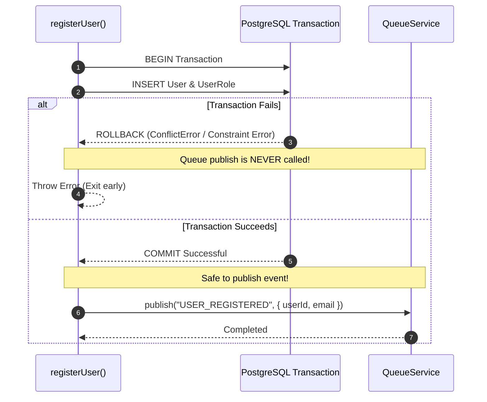

# Queue Abstraction & Event Publishing

This document details the implementation of **Task 22 (Queue Abstraction)** and **Task 23 (Publish USER_REGISTERED)**.

---

## 1. Dependency Abstraction: `QueueService`

To decouple business logic from messaging infrastructure (RabbitMQ, AWS SQS, Redis BullMQ), a generic interface is defined at [`src/common/queue/queue.interface.ts`](../../src/common/queue/queue.interface.ts):

```ts
export interface QueueService {
  publish(eventName: string, payload: unknown): Promise<void>;
}
```

---

## 2. Local Adapter (`LocalQueueService`)

The default adapter [`LocalQueueService`](../../src/common/queue/localQueue.service.ts) logs events using Pino structured logging and maintains an in-memory history for testing:

```ts
export class LocalQueueService implements QueueService {
  private events: PublishedEvent[] = [];

  async publish(eventName: string, payload: unknown): Promise<void> {
    const event: PublishedEvent = {
      eventName,
      payload,
      timestamp: new Date(),
    };
    this.events.push(event);

    logger.info(
      { eventName, payload },
      `[LocalQueueService] Event published: ${eventName}`,
    );
  }

  getEvents(): PublishedEvent[] {
    return [...this.events];
  }

  getEventsByName(eventName: string): PublishedEvent[] {
    return this.events.filter((e) => e.eventName === eventName);
  }

  clear(): void {
    this.events = [];
  }
}
```

---

## 3. Transaction Guarantee: Post-Commit Publishing (Task 23)

### The Problem
Publishing domain events *before* database commit creates race conditions: if the database transaction fails (e.g. duplicate email, unique constraint failure), listeners (welcome email workers, analytics services) might process an event for a record that does not exist.

### The Solution
The event is dispatched **strictly after** the database transaction completes:



### Implementation (`src/modules/auth/auth.service.ts`)
```ts
// 1. Transaction commits inside createUser repository call
const user = await create({ email, password });

// 2. Publish domain event only after DB transaction is committed
await queue.publish("USER_REGISTERED", {
  userId: user.id,
  email: user.email,
});
```

### Event Payload Schema
```json
{
  "userId": "123e4567-e89b-12d3-a456-426614174000",
  "email": "user@example.com"
}
```

---

## 4. Future Cloud Migration (Local Adapter $\rightarrow$ AWS SQS)

Because of the `QueueService` abstraction, switching to AWS SQS requires **zero changes** to business logic in `auth.service.ts`:

```ts
// Example: src/common/queue/sqsQueue.service.ts
import { SQSClient, SendMessageCommand } from "@aws-sdk/client-sqs";
import type { QueueService } from "./queue.interface";

export class SqsQueueService implements QueueService {
  constructor(private client: SQSClient, private queueUrl: string) {}

  async publish(eventName: string, payload: unknown): Promise<void> {
    await this.client.send(new SendMessageCommand({
      QueueUrl: this.queueUrl,
      MessageBody: JSON.stringify({ eventName, payload }),
      MessageAttributes: {
        EventType: { DataType: "String", StringValue: eventName }
      }
    }));
  }
}
```
Simply export `new SqsQueueService(...)` in place of `localQueueService`.
