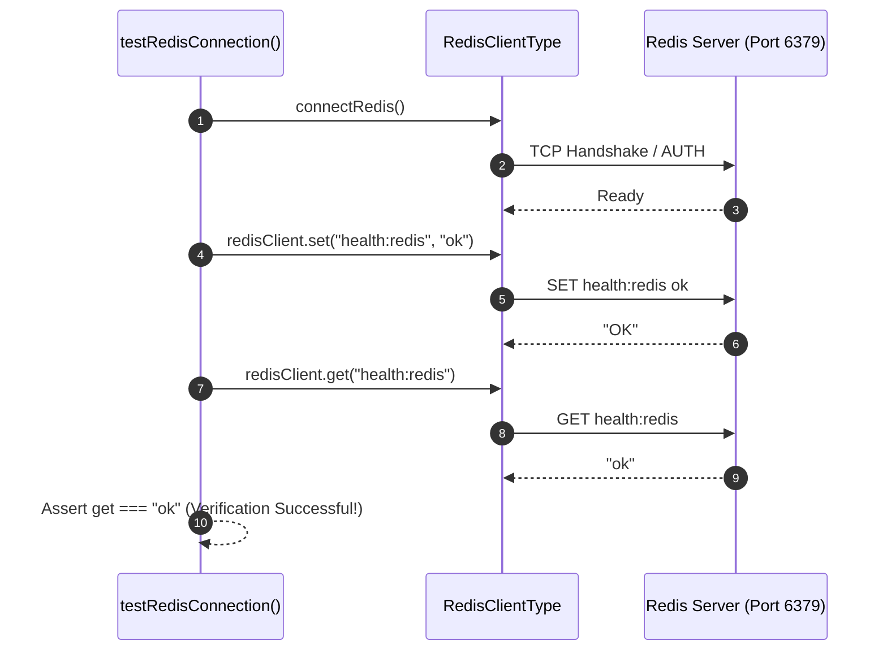

# Redis Connection & Infrastructure Integration

This document outlines the implementation of **Task 21 (Redis Connection)**.

---

## 1. Overview & Objective

The goal of Task 21 is to **prove infrastructure integration works** between the Node.js backend application and the Redis cache service running via Docker. Full application caching is intentionally separated to maintain focus on infrastructure stability and health verification.

---

## 2. Configuration & Connection Lifecycle

Redis connectivity is managed in [`src/config/redis.ts`](../../src/config/redis.ts) using the official `redis` client:

```ts
import { createClient, type RedisClientType } from "redis";
import { env } from "./env";
import { logger } from "../common/logger";

export const redisClient: RedisClientType = createClient({
  url: env.REDIS_URL,
});

redisClient.on("error", (err) => {
  logger.error({ err }, "Redis Client Error");
});

redisClient.on("connect", () => {
  logger.info("Redis Client Connected");
});

redisClient.on("ready", () => {
  logger.info("Redis Client Ready");
});

export async function connectRedis(): Promise<RedisClientType> {
  if (!redisClient.isOpen) {
    await redisClient.connect();
  }
  return redisClient;
}

export async function disconnectRedis(): Promise<void> {
  if (redisClient.isOpen) {
    await redisClient.quit();
  }
}
```

---

## 3. Infrastructure Health Verification Protocol

To verify that the Redis client can communicate and store data in the Redis container:



### Verification Helper (`src/config/redis.ts`)
```ts
export async function testRedisConnection(): Promise<{
  set: string | null;
  get: string | null;
}> {
  await connectRedis();
  const set = await redisClient.set("health:redis", "ok");
  const get = await redisClient.get("health:redis");
  return { set, get };
}
```

---

## 4. Docker Integration

The Redis instance is managed via `docker-compose.yml`:

```yaml
cache:
  image: redis:latest
  container_name: redis-cache
  restart: unless-stopped
  ports:
    - "6379:6379"
  volumes:
    - redis_data:/data
  command: redis-server --appendonly yes
```

### Direct CLI Commands
```bash
# Connect to Redis CLI in container
docker compose exec cache redis-cli

# Test inside Redis CLI
127.0.0.1:6379> SET health:redis ok
OK
127.0.0.1:6379> GET health:redis
"ok"
```
