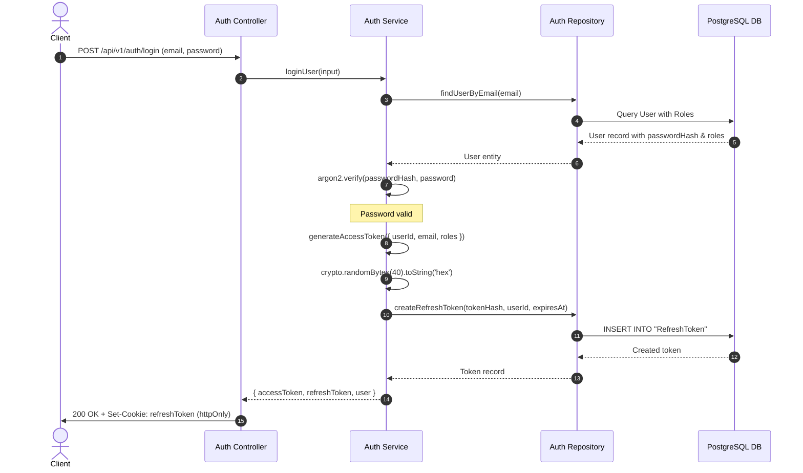
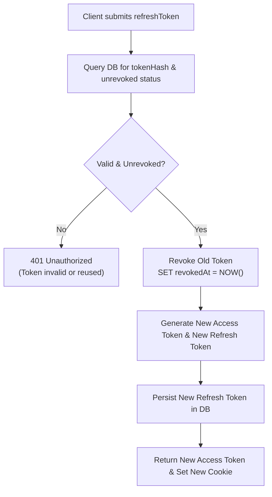

# Authentication & Token Management

This document details the authentication flow, password hashing, JWT generation, and refresh token rotation mechanisms.

---

## 1. Authentication Lifecycle



---

## 2. Password Security with Argon2

Passwords are encrypted using **Argon2id** via the `argon2` library:

* **Hashing during Registration (`src/modules/auth/auth.repository.ts`)**:
  ```ts
  const passwordHash = await argon2.hash(data.password);
  ```
* **Verification during Login (`src/modules/auth/auth.service.ts`)**:
  ```ts
  const isPasswordValid = await argon2.verify(userExists.passwordHash || "", password);
  if (!isPasswordValid) {
    throw new UnauthorizedError("Invalid email or password");
  }
  ```

---

## 3. JWT Access Token Structure

Access tokens are signed using HMAC-SHA256 with the secret `env.JWT_SECRET`:

* **Expiration**: Configurable via `env.JWT_EXPIRES_IN` (default: `15m`).
* **Payload Claims**:
  ```json
  {
    "userId": "uuid-v4",
    "email": "user@example.com",
    "roles": ["USER", "ADMIN"],
    "iat": 1727980000,
    "exp": 1727980900
  }
  ```

---

## 4. Refresh Token Rotation (RTR)

To protect against token theft, refresh tokens follow a strict rotation model:



1. **Exchange**: The client sends the refresh token to `POST /api/v1/auth/refresh`.
2. **Revocation**: The old refresh token is marked revoked immediately (`revokedAt = new Date()`).
3. **Re-issuance**: A new access token and a brand-new cryptographically random refresh token are created and stored.
4. **Logout**: When `POST /api/v1/auth/logout` is called, all active refresh tokens for the user are revoked.
