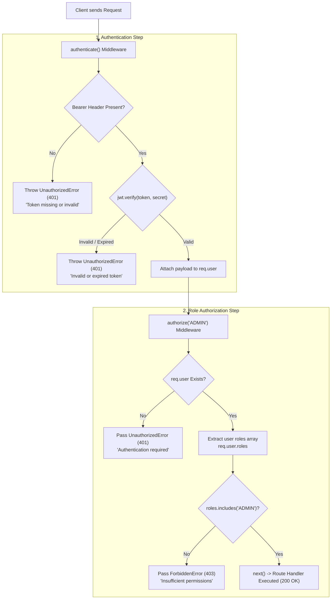

# Role-Based Access Control (RBAC) & Authorization

This document details the implementation of **Task 19 (RBAC Middleware)** and **Task 20 (Admin Route)**.

---

## 1. Key Principles: 401 vs 403

| Status Code | Meaning | Condition | Response Code |
| :--- | :--- | :--- | :--- |
| **`401 Unauthorized`** | Not Authenticated | Missing token, malformed Bearer header, invalid signature, or expired JWT. | `UNAUTHORIZED` |
| **`403 Forbidden`** | Authenticated but Not Allowed | Valid authentication token, but the user account does not possess the required role. | `FORBIDDEN` |

---

## 2. Decision & Evaluation Flowchart



---

## 3. Middleware Implementation

### `authenticate()` Middleware
Located at [`src/middlewares/auth.ts`](../../src/middlewares/auth.ts):
* Supports both direct middleware handler invocation `router.get(..., authenticate, ...)` and factory style `router.get(..., authenticate(), ...)`.
* Extracts Bearer token from `req.headers.authorization`.
* Decodes and verifies JWT against `env.JWT_SECRET`.
* Attaches decoded payload (including `userId`, `email`, `roles`) to `req.user`.

```ts
export const authenticate = (reqOrOptions?: Request | any, res?: Response, next?: NextFunction): any => {
  const handler: RequestHandler = (req, _res, nextFn) => {
    try {
      const authHeader = req.headers.authorization;
      if (!authHeader || !authHeader.startsWith("Bearer ")) {
        return nextFn(new UnauthorizedError("Authentication token missing or invalid"));
      }

      const token = authHeader.split(" ")[1] || "";
      const decoded = jwt.verify(token, env.JWT_SECRET);
      req.user = decoded;
      return nextFn();
    } catch {
      return nextFn(new UnauthorizedError("Invalid or expired token"));
    }
  };

  if (reqOrOptions && res && next && typeof next === "function") {
    return handler(reqOrOptions as Request, res, next);
  }
  return handler;
};
```

### `authorize(...allowedRoles)` Middleware
Located at [`src/middlewares/auth.ts`](../../src/middlewares/auth.ts):
* Returns a middleware handler that verifies `req.user` exists.
* Flattens and checks the user's assigned roles against the required roles list.
* If user lacks the role, passes `ForbiddenError` (HTTP 403).

```ts
export const authorize = (...allowedRoles: (string | string[])[]) => {
  const targetRoles = allowedRoles.flat();

  return (req: Request, _res: Response, next: NextFunction): void => {
    if (!req.user) {
      return next(new UnauthorizedError("Authentication required"));
    }

    const user = req.user as any;
    let userRoles: string[] = [];
    if (Array.isArray(user.roles)) {
      userRoles = user.roles;
    } else if (typeof user.role === "string") {
      userRoles = [user.role];
    }

    const hasRole = targetRoles.some((role) => userRoles.includes(role));
    if (!hasRole) {
      return next(new ForbiddenError("Access forbidden: insufficient permissions"));
    }

    return next();
  };
};
```

---

## 4. Protected Admin Route (Task 20)

### Endpoint
`GET /api/v1/admin/health` (also mounted at `/v1/admin/health`).

### Route Definition (`src/modules/admin/admin.routes.ts`)
```ts
router.get("/health", authenticate(), authorize("ADMIN"), getAdminHealth);
```

### Verification Scenarios
| Request Scenario | Header | Expected Status |
| :--- | :--- | :--- |
| **No Token** | None | `401 Unauthorized` |
| **Malformed Token** | `Bearer garbage.jwt` | `401 Unauthorized` |
| **User Role (`USER`)** | `Bearer <user_token>` | `403 Forbidden` |
| **Admin Role (`ADMIN`)** | `Bearer <admin_token>` | `200 OK` |
| **Multi-role (`USER`, `ADMIN`)** | `Bearer <multi_role_token>` | `200 OK` |
